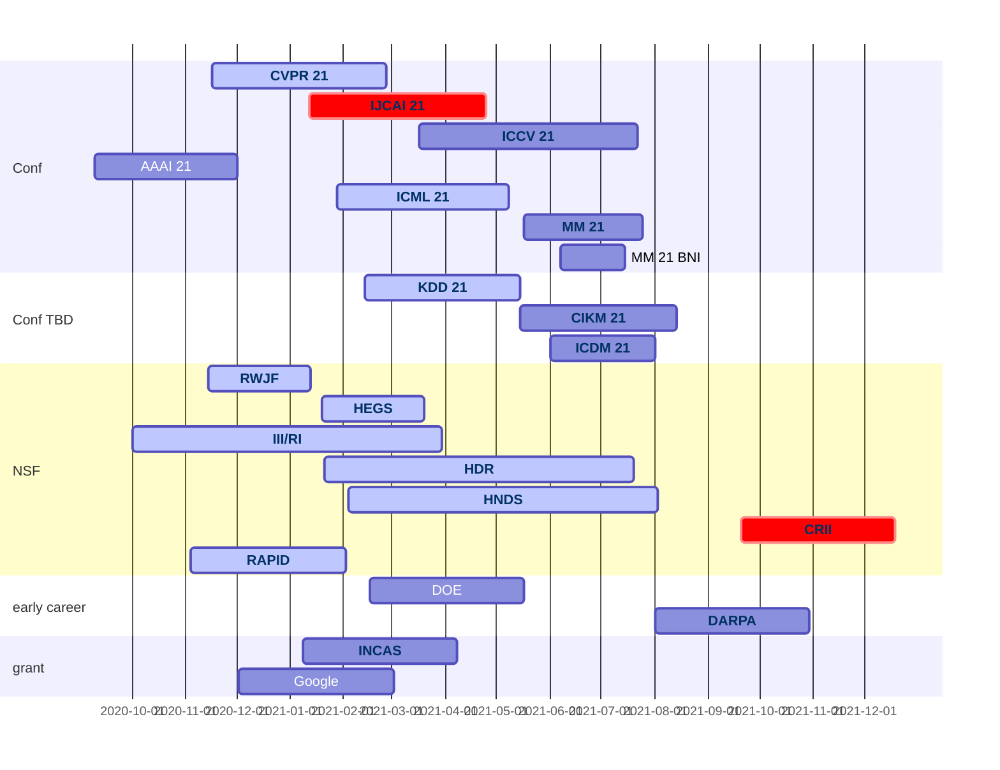

- [Adobe Data Science Research Award](https://www.adobe.com/careers/university/marketing-research.html)
- [Amazon Research Award](https://www.amazon.science/research-awards)
- [MSR Academic Programs](https://www.microsoft.com/en-us/research/academic-programs/faculty/?facet%5Btax%5D%5Bmsr-program-audience%5D%5B%5D=243727&facet%5Btax%5D%5Bmsr-program-type%5D%5B%5D=155533)
- [MSR AI for Accessibility Grant](https://www.microsoft.com/en-us/ai/ai-for-accessibility-grants)
- [MSR Identity Project Grant](https://www.microsoft.com/en-us/msrc/grant-microsoft-identity)
- [Nvidia Higher Education and Research Grants](https://developer.nvidia.com/academic_gpu_seeding)
- [Nvidia GPU Grant](https://developer.nvidia.com/gpu-grant-application)
- [Salesforce AI](https://einstein.ai/outreach/grants)
- [Bill & Melinda Gates Foundation](https://submit.gatesfoundation.org)
- [Simons Foundation](https://www.simonsfoundation.org/funding-opportunities/)
- [Facebook Research](https://research.fb.com/research-awards/)