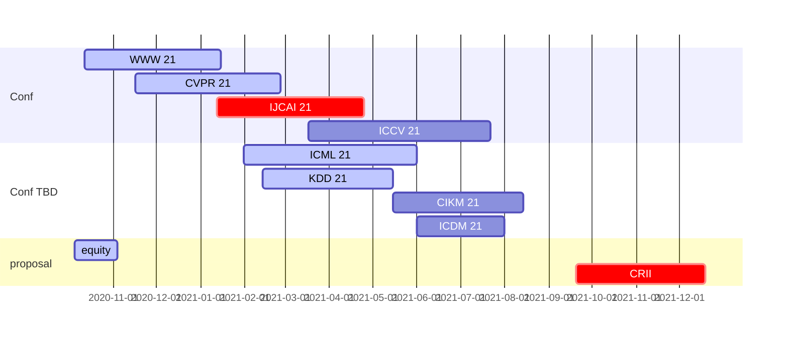

```mermaid
gantt
  dateFormat  MM/DD/YY
  section Conf
    WWW 21 :active, www, 10/12/20, 01/15/21
    CVPR 21 :active, cvpr, 11/16/20, 02/26/21
    IJCAI 21 :crit, ijcai, 01/12/21, 04/25/21
    ICCV 21 :iccv, 03/17/21, 07/22/21
  section Conf TBD
    ICML 21:active, icml, 01/31/21, 06/01/21
    KDD 21:active, kdd, 02/13/21, 05/15/21
    CIKM 21:cikm, 05/15/21, 08/14/21
    ICDM 21:icdm, 06/01/21, 08/01/21
  section proposal
    equity: active, msu, 10/05/20, 30d
    CRII: crit, crii, 09/20/21, 90d 

```