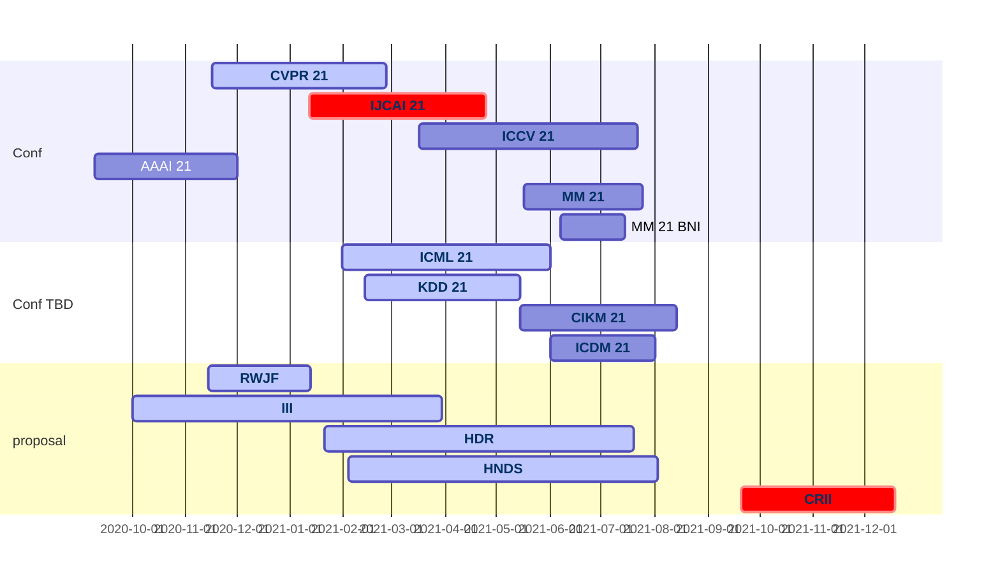

```mermaid
gantt
  dateFormat  MM/DD/YY
  section Conf
    CVPR 21 :active, cvpr, 11/16/20, 02/26/21
    IJCAI 21 :crit, ijcai, 01/12/21, 04/25/21
    ICCV 21 :iccv, 03/17/21, 07/22/21
    AAAI 21 :aaai, 09/09/20, 12/01/20
    MM 21:mm, 05/17/21, 07/25/21
    MM 21 BNI:mmbni, 06/07/21, 07/15/21
  section Conf TBD
    ICML 21:active, icml, 01/31/21, 06/01/21
    KDD 21:active, kdd, 02/13/21, 05/15/21
    CIKM 21:cikm, 05/15/21, 08/14/21
    ICDM 21:icdm, 06/01/21, 08/01/21
  section proposal
    RWJF :active, rwjf, 11/14/20, 60d
    III: active, iii, 10/01/20, 180d
    HDR :active, hdr, 01/21/21, 180d
    HNDS :active, hnds, 02/04/21, 180d
    CRII :crit, crii, 09/20/21, 90d 

  click cvpr href "http://cvpr2021.thecvf.com/"
  click iccv href "http://iccv2021.thecvf.com/"
  click icml href "https://mermaidjs.github.io/"
  click ijcai href "http://www.ijcai-21.org/"
  click kdd href "http://www.kdd.org/kdd2021"
  click www href "https://www2021.thewebconf.org/"
  click cikm href "https://www.cikm2021.org/"
  click icdm href "http://icdm2021.bigke.org"
  click mm href "https://2020.acmmm.org/index.html"
  click crii href "https://www.nsf.gov/funding/pgm_summ.jsp?pims_id=504952"
  click hdr href "https://www.nsf.gov/funding/pgm_summ.jsp?pims_id=505828&org=NSF&sel_org=CISE&from=fund"
  click hnds href "https://www.nsf.gov/funding/pgm_summ.jsp?pims_id=505702"
  click rwjf href "https://anr.rwjf.org/viewCfp.do?cfpId=1509&cfpOverviewId="
  click iii href "https://www.nsf.gov/funding/pgm_summ.jsp?pims_id=505667&org=NSF"
```