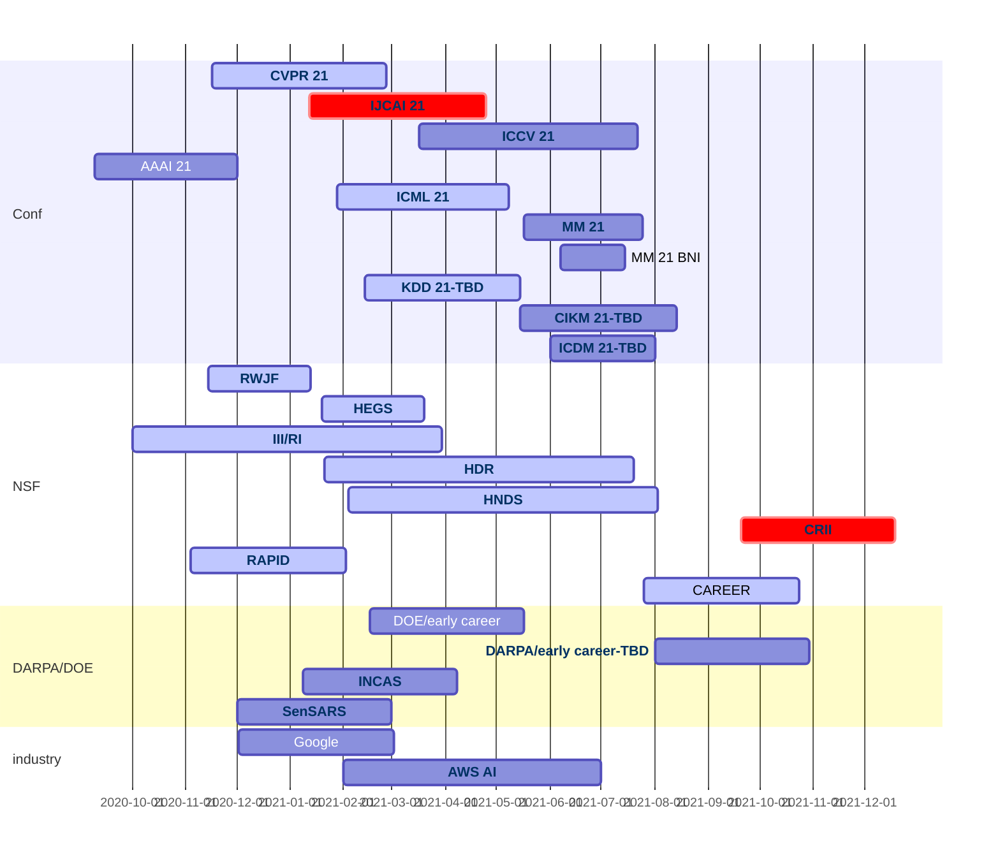

# Industry
- [XSEDE Startup Allocation](https://portal.xsede.org/allocations/startup)
- [BSF](https://www.bsf.org.il/funding-opportunities/bsf-research-grants/about/)
- [Adobe Data Science Research Award](https://www.adobe.com/careers/university/marketing-research.html)
- [Amazon Research Award](https://www.amazon.science/research-awards)
- [MSR Academic Programs](https://www.microsoft.com/en-us/research/academic-programs/faculty/?facet%5Btax%5D%5Bmsr-program-audience%5D%5B%5D=243727&facet%5Btax%5D%5Bmsr-program-type%5D%5B%5D=155533)
- [MSR AI for Accessibility Grant](https://www.microsoft.com/en-us/ai/ai-for-accessibility-grants)
- [MSR Identity Project Grant](https://www.microsoft.com/en-us/msrc/grant-microsoft-identity)
- [IBM Research Award](https://www.research.ibm.com/university/awards/faculty.html)
- [Alibaba Innovative Research](https://damo.alibaba.com/air/)
- [Tencent AI Lab Rhino-Bird Focused Research Program](https://ur.tencent.com/article/255)
- [Twitter Data Grant](https://blog.twitter.com/engineering/en_us/a/2014/introducing-twitter-data-grants.html)
- [Samsung Global Research Outreach](https://www.sait.samsung.co.kr/saithome/about/collabo_apply.do#subTitle)
- [Nvidia GPU Grant](https://developer.nvidia.com/gpu-grant-application)
- [Nvidia Higher Education and Research Grants](https://developer.nvidia.com/academic_gpu_seeding)- [Facebook Research](https://research.fb.com/research-awards/)
- [Salesforce AI](https://einstein.ai/outreach/grants)
- [PCORI](https://www.pcori.org/funding-opportunities)
- [Didi Chuxing Research](https://outreach.didichuxing.com)
- [Huawei Innovation Research Program](https://innovationresearch.huawei.com/IPD/hirp/portal/index.html)
- [Snap Research Fellowship & Scholarship](https://snapresearchfs.splashthat.com)
- [Artist + ML](https://medium.com/artists-and-machine-intelligence)

# Gov
- [By Agency](https://www.grants.gov/web/grants/learn-grants/grant-making-agencies.html)
- [NIST funding opportunities](https://www.nist.gov/oaam/grants-management-division/nist-nofo-information?aid=11%25252525252525253Faid%25252525252525253D11%2525252525253Faid%3D11%25252525252525253Faid%25252525252525253D11)
- [DOT](https://www.transportation.gov/rural/funding-opportunities)
- FHWA： [1](https://www.fhwa.dot.gov/resources/topics/funding.cfm) [2](https://www.fhwa.dot.gov/fastact/funding.cfm) [3](https://highways.dot.gov/research/research-programs/exploratory-advanced-research/exploratory-advanced-research-overview)
- [Air Force Research Lab (AFRL)](https://afrl.dodlive.mil/funding/)
- [Air Force Office Science Research (AFOSR)](https://www.afrl.af.mil/About-Us/Fact-Sheets/Fact-Sheet-Display/Article/2282103/afosr-funding-opportunities/)
- [NIJ](https://nij.ojp.gov/funding/forthcoming)
- [Army Research Office](https://cdmrp.army.mil/funding/prgdefault)
- [Army Research Lab](https://www.arl.army.mil/business/broad-agency-announcements/)
- [Office of Naval Research](https://www.onr.navy.mil/en/work-with-us/funding-opportunities)
- [IMLS](https://www.imls.gov/grants/apply-grant/available-grants)
- [US Geological Survey](https://www.usgs.gov/about/organization/science-support/administration/office-acquisition-and-grants)
- [NOAA Sea Grant](https://seagrant.noaa.gov/News/PID/468/evl/0/TagID/590/TagName/National-Water-Center)

# Foundation
- [Bill & Melinda Gates](https://submit.gatesfoundation.org)
- [Simons](https://www.simonsfoundation.org/funding-opportunities/)
- [WW](https://woodrow.org)
- [MacArthur](https://www.macfound.org/grants/)
- [Robert Wood Johnson](https://www.rwjf.org)
- [Pitney Bowes](https://www.pitneybowes.com/content/dam/pitneybowes/us/en/our-company/corporate-responsibility/pitney-bowes-foundation-grant-guidelines-and-application.pdf)

https://github.com/dhanus/graduate-fellowships

